# Documentação da API de OpenBank da Conta Stone

O [site](https://stone-co.github.io/) com a documentação da nossa API de OpenBank usa
[Hugo](https://gohugo.io/), um framework open-source escrito em [Golang](https://go.dev/) para construção de sites
estáticos.

Seu funcionamento é simples: a usuária escolhe um [tema](https://themes.gohugo.io/), insere conteúdo em arquivos de
formato __markdown__, edita um arquivo de configuração `.toml` para promover customizações e voilà - 🐭🪄 a mágica
gopher acontece!

## Visão geral do projeto

### Repositórios relacionados

Este é o repositório principal do site da documentação e todo o conteúdo deve ser adicionado aqui, mas existem outros
dois repositórios relacionados ao projeto:

1) *Tema*: o tema que utilizamos é baseado no tema [Docsy](https://themes.gohugo.io/docsy/)
   e pode ser encontrado [nesse repositório aqui](https://github.com/stone-co/docsy). Temos um fork para que seja
   possível promovermos alterações diretamente no estilo que não seriam possíveis através do arquivo de configuração. Em
   nosso projeto, ele é consumido e referenciado como um submódulo git.

2) *Site Sandbox*: o código-fonte do site no ambiente de sandbox, que é gerado pelo código deste repositório + hugo, a
   cada push na master, pode ser encontrado [aqui](https://github.com/stone-co/sandbox). Cumpre esclarecer que o
   ambiente de sandbox é usado como pré-produção

3) *Site Produção*: o código-fonte do site, que é gerado pelo código deste repositório + hugo, a cada nova tag de
   release, pode ser encontrado [aqui](https://github.com/stone-co/stone-co.github.io)

### Contribuindo

#### Nomeando arquivos e diretórios

A url do site vai ser baseada no nome dos diretórios que ficam sob o diretório `content`. Por isso, é importante que:

- espaços sejam representados por hífens
- acentos e pontuações não sejam utilizados
- os nomes sejam simples e representem aquilo que queremos ver na url

Os artigos devem receber o nome `_index.pt.md` e devem estar dentro de uma pasta com o nome do título.

#### Seções da Home

As seções da home precisam ter o tipo `docs` __(type : "docs")__ indicado em seus cabeçalhos. Além disso, precisam ter
um ícone, que deve ser indicado no campo `icon` e pode ser escolhido
[aqui](https://themify.me/themify-icons), e uma descrição, que deve ser preenchida no campo
`description`.

#### Ordem do conteúdo

Se nenhuma providência for tomada, as seções e posts vão se organizar em ordem alfabética simples. Para impôr uma ordem
intencional, é necessário preencher o campo `weight` do cabeçalho. O primeiro conteúdo que deve aparecer deve
ter `weight` igual a 1, o segundo igual a 2, e assim por diante.

#### Fluxo de Git

Devemos seguir
o [Guia de Estilo Git StoneCo](https://github.com/stone-payments/stoneco-best-practices/blob/master/gitStyleGuide/README_pt.md#commits)
para abertura de branch, escrita de commit e abertura de pull requests, dentro do fluxo abaixo:



### Deploy

Conforme falado anteriormente, a documentação é disponibilizada em dois ambientes, Sandbox e Produção. A atualização
desses ambientes ocorre por meio de duas GitHub Action's, uma para cada ambiente. Essas ações rodam o
Hugo e alimentam o repositório de interesse (Sandbox ou Produção) do site com as alterações - o que, por sua vez, desencadeia a ação de
atualização do site, que utiliza o [GitHub Pages](https://pages.github.com/).

#### Em Sandbox

Temos a [Action](https://github.com/stone-co/stone-api-docs/blob/master/.github/workflows/sandbox.yml)
que desencadeia uma nova construção do site sempre que a branch master deste repositório é atualizada.

#### Em Produção

Temos a [Action](https://github.com/stone-co/stone-api-docs/blob/master/.github/workflows/release.yml)
que desencadeia uma nova construção do site sempre que geramos uma tag de release.

## Usando Hugo

### Instalando

#### Windows

Faça download do executável do
Hugo [Windows 64 bits](https://github.com/gohugoio/hugo/releases/download/v0.64.0/hugo_0.64.0_Windows-64bit.zip)
ou [Windows 32 bits](https://github.com/gohugoio/hugo/releases/download/v0.64.0/hugo_0.64.0_Windows-32bit.zip)
(este executável não é um instalador, é necessário fazer a instalação manual)

Descompacte o conteúdo do ZIP para a pasta `C:\Hugo\bin` (pode ser na pasta que preferir)

Copie o caminho onde está o executável `hugo.exe` para configurar seu sistema para reconhecer o comando Hugo. Para isso
você deve configurar a variável de ambiente `PATH` seguindo os passos abaixo:

> 1. Em Iniciar > Pesquisar, procure e selecione: Sistema (Painel de Controle)
> 2. Clique no link Configurações avançadas do sistema.
> 3. Clique em Variáveis de Ambiente. Na seção Variáveis do Sistema, localize a variável de ambiente `PATH` e selecione-a. Clique em Editar. Se a variável de ambiente `PATH` não existir, clique em Novo.
> 4. Na janela Editar Variável de Sistema (ou Nova Variável de Sistema), especifique o valor (`C:\hugo\bin\`) da variável de ambiente `PATH`. Clique em OK. Feche todas as janelas restantes clicando em OK.
> 5. Reabra o terminal e execute `$ hugo version`.

Outras formas de instalação podem ser encontradas [aqui](https://gohugo.io/getting-started/installing/#windows)

#### Mac OS

Sugerimos que seja usado o [Homebrew](https://brew.sh), mas no próprio site do Hugo há mais
instruções ([aqui](https://gohugo.io/getting-started/installing/#macos)).

Comando para instalar com Homebrew: `$ brew install hugo`

#### Linux

Use o package manager da sua distro/de sua preferência, instruções
adicionais [aqui](https://gohugo.io/getting-started/installing/#linux)

### Adicionando conteúdo

- Para criar um novo conteúdo (na prática, vai ser criado um arquivo __markdown__ que vai ser usado para gerar uma nova
  página __html__), deve-se digitar o seguinte comando:

  `$ hugo new content/nome-da-secao/nome-do-artigo/_index.pt.md`

- Em seguida, editar o arquivo que foi criado e adicionar o conteúdo que desejar após o fim do cabeçalho
  (sinalizado por `---`). O arquivo estará em:
    ``` 
    📂stone-api-docs    
    └──📂content    
       └──📂nome-da-secao
          └──📂nome-do-artigo
             └──📄_index.pt.md
    ```

- Cada artigo tem um campo no cabeçalho `draft`, que pode ter o valor `true` (caso seja ainda um rascunho)
  ou `false` (caso deva ser publicado). O default do campo é `true`, altere para `false` para sinalizar que o artigo
  deve ser publicado!

### Rodando localmente

Como o projeto necessita de git submodules para seu funcionamento, você deve inicia-los da seguinte forma:

- Caso ainda não tenha clonado o projeto:
    ```shell
    $ git clone --recurse-submodules https://github.com/stone-co/stone-api-docs.git
    ```

- Caso já tenha clonado:
    ```shell
    $ git submodule update --init --recursive
    ```

É importante rodar localmente antes de submeter as suas contribuições para o repositório remoto para poder visualizar o
site e verificar se não há erros na sua construção.

- Digitar no terminal o seguinte comando:
    ```shell
    $ hugo server
    ```

- Em seu navegador, visitar o endereço __localhost:1313__ (ou o endereço que for informado no próprio terminal após
  rodar o comando acima)

- Para parar, apertar `Ctrl + C` no terminal

--------

Para mais informações sobre Hugo: [getting started do Hugo](https://gohugo.io/getting-started/quick-start/) e
[oficina de sites estáticos com hugo](https://github.com/womenwhogocwb/oficina-hugo).
