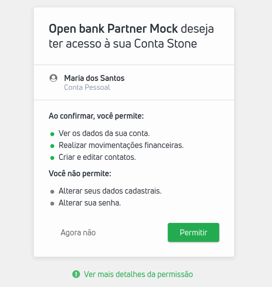
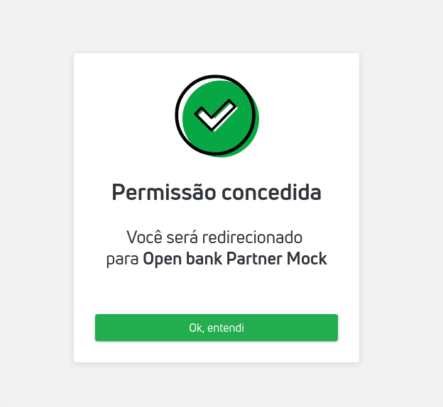

<br>

### Overview
---
<br>

O **Consentimento** é um conceito fundamental no Open Banking, pois a partir da realização deste processo, um usuário poderá permitir o compartilhamento de suas informações entre diferentes instituições autorizadas pelo Banco Central e a movimentação de suas contas bancárias a partir de diferentes plataformas e não apenas pelo aplicativo ou site do banco, de forma segura, ágil e conveniente.

Para instituições que desejem pedir consentimento a usuários da Conta Stone, basta gerar um link de consentimento em nossa API e enviar o mesmo para avaliação do usuário dono da conta. 
<br>A partir da aprovação do usuário, a plataforma parceira terá acesso aos escopos solicitados. 

<br>

### Fluxo de Consentimento
---
<br>

A partir da abertura de conta realizada pelo usuário, uma plataforma poderá solicitar acesso ao compartilhamento de informações e iniciação de pagamentos na conta de um usuário. Para isso, deverá gerar um **Link de Consentimento** dentro do padrão estabelecido. 

Após gerar e enviar o Link ao usuário, poderão acontecer três situações, das quais o parceiro será notificado:

###### **Usuário acessa o link e dá consentimento ao parceiro**

Ao acessar o link, o usuário será direcionado para um página da Stone em que irá escolher a quais contas de pagamento ele deseja conceder acesso ao parceiro. Ele também poderá verificar a quais escopos o parceiro passará a ter acesso após dar consentimento. Uma vez dado o consentimento, o usuário deverá ser direcionado de volta a uma página do parceiro. 

Veja abaixo um exemplo da tela de pedido de consentimento que será disponibilizada ao cliente:



<br>
Veja abaixo um exemplo de permissão concedida:



<br>Ao clicar no botão "Ok, entendi" o usuário será redirecionado para uma página da aplicação parceira, cujo endereço foi definido no [Cadastro da Aplicação]().

<br>

###### **Usuário acessa o link e não dá consentimento ao parceiro**

<br>

Pode acontecer também o caso em que o usuário rejeitar o consentimento solicitado. Neste caso, ele será redirecionado a uma página do parceiro. O parceiro, neste caso, não poderá acessar informações nem operar a conta do usuário. 


**Atenção!** <br>Em ambos os casos citados acima, faremos um redirecionamento para a URI cadastrada no token. Acrescentaremos na URI os seguintes campos: 

<br>

| Chave | Valor |
| ----- | ----- | 
| session_metadata | Com os mesmos os valores de passados no token. |
| consent_result | Indica o resultado do pedido de consentimento e pode ter os seguintes valores:<br>- `ignored`: caso o usuário não dê consentimento;<br>- `approved`: caso ele dê o consentimento e<br>- `already_granted`: caso o consentimento desse recurso para essa aplicação já tenha sido dado anteriormente. | 
| resource_id | Identificador do resource ao qual o consentimento foi dado. Só é retornado quando o resultado do consent é `approved`. |

<br>

Quando o consent_result é `approved` é enviado também o webhook consent_requested com os dados do consentimento dado. Dessa forma, você poderá prover uma experiência fluída para ambos os casos, basta validar estes campos! 

<br>

###### **Usuário ignora o link**

<br>

O link de consentimento tem validade de 2 horas após a sua geração. Caso o usuário não acesse o mesmo dentro desse período, será necessário gerar um novo link e fazer um novo envio. 


<br>

### Gerando Link de Consentimento
---
<br>

Após cadastrar e autenticar a sua aplicação, você está apto a pedir consentimento aos seus clientes que tenham realizado a abertura de uma conta Stone. Ressaltamos que toda interação com o usuário neste processo será gerida por nossa plataforma. 

Seguindo os parâmetros descritos abaixo, você deverá enviar o link ao usuário por meio da sua aplicação. 
<br>O link de consentimento deve ser enviado dentro da própria aplicação. Você pode, por exemplo, disponibilizar um botão em sua plataforma para que o usuário acesse o link. Este link não deve ser enviado ao usuário por e-mail sob hipótese alguma.

<br>

##### **Parâmetros do link de consentimento**

O link de consentimento deverá conter três parâmetros:
- client_id: o ClientID recebido pelo desenvolvedor pós-cadastro;
- type: no caso, será sempre o valor “consent”;
- jwt: será um token gerado localmente pelo desenvolvedor com a mesma chave privada e algoritmo que ele usa para se autenticar. Mais detalhes abaixo.

Com estes parâmetros, basta gerar um link no seguinte formato (por ambiente), substituindo CLIENT_ID e JWT por seus respectivos valores:

|   |   |
| - | - | 
| Sandbox | https://sandbox.conta.stone.com.br/consentimento?client_id=CLIENT_ID&jwt=JWT |
| Produção | https://conta.stone.com.br/consentimento?client_id=CLIENT_ID&jwt=JWT |

<br>


Assim como fizemos o processo de gerar um Token de Acesso autenticado, também será gerado um JWT para pedido do Consentimento. 

<br>

##### **Especificações do JWT para pedir consentimento**

<br>

**Header**
<br>Observe que é preciso assinar o token JWT com a chave privada da aplicação e o algoritmo RS256, assim como é feito para o token de autenticação. Dessa forma, neste token também é preciso incluir um header com as informações sobre o algoritmo de criptografia utilizado, entre outros metadados, como um id da chave utilizada. Por exemplo:

```json
{
  "alg": "RS256",
  "typ": "JWT"
}
```

<br>

**Payload**
<br>O token deve conter os claims abaixo:

| Campos  **Obrigatórios**   | Descrição        | Tipo           |
| ---------------- | ---------------- | -------------- |
| type             | Será sempre "consent" neste caso.    | _String_ |
| client_id        | Será o ClientID da Aplicação Parceira.  | _String_ |
| redirect_uri     | A URI para redirecionamento após a ação do usuário. Esta URI foi informada previamente no cadastro da Aplicação Parceira. Caso seja enviada uma URI diferente, retornará erro.  | _String_ |
| session_metadata | Um objeto que contenha qualquer chave relevante para o parceiro identificar a sessão do usuário. Este valor estará presente na URI de redirecionamento e não pode ser nulo ou um mapa vazio. | _Objeto_ |
| iss              | Usar o client_id da Aplicação.   | _String_ |
| iat              | Momento em que o token foi gerado. É um timestamp UTC. Exemplo: "iat": 1542235633.   | _Int_    |
| aud              | accounts-hubid@openbank.stone.com.br   | _String_ |
| jti              | Identificador único do token gerado. Normalmente se utiliza um UUID.     | _String_ |
| nbf              | É o momento em que o token passa a ser válido. Na maioria dos casos terá o mesmo valor que iat (issued at) pois queremos que ele esteja válido logo a partir do momento de geração.          | _Int_    |
| exp              | Momento de expiração do token em segundos desde o início da era UNIX (1970). É um timestamp UTC e não pode ser maior que 2 horas. Exemplo: "exp": 1542235633   | _Int_    |

<br>

Segue um exemplo de como ficariam os claims preenchidos: 

<br>

```json
{
  "type": "consent",
  "client_id": "MY CLIENT ID", 
  "iss": "MY CLIENT ID",
  "redirect_uri": "https://mypreviouslyregistereduri.com",
  "session_metadata": {
    "user_session": "xxxxxxxxxxxxxxxxxxxxx",
  },
  "iat": 1542235633,
  "nbf": 1542235633,
  "exp": 1549069563,
    "jti": "41e8aa9f-bb9c-4fd2-9953-2595dbbd5a83",
  "aud": "accounts-hubid@openbank.stone.com.br"
}
```

